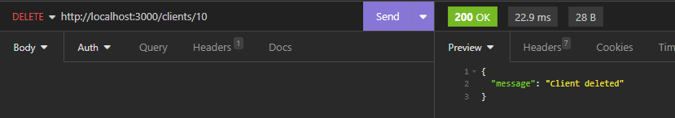

# API Taller Mecánico – CRUD con Node.js, Express y Sequelize

Este proyecto es una **simulación de un sistema para la gestión de un taller mecánico**, desarrollado con Node.js, Express y Sequelize (ORM para MySQL). El sistema permite registrar, consultar, actualizar y eliminar información sobre **clientes**, **vehículos** y **servicios realizados**. Cada auto está asociado a un cliente, y cada servicio está asociado a un auto.

## Endpoints

### Clientes – `/clients`
| Método | Ruta               | Descripción                |
|--------|--------------------|----------------------------|
| GET    | `/clients`         | Obtener todos los clientes |
| GET    | `/clients/:id`     | Obtener un cliente         |
| POST   | `/clients`         | Crear cliente              |
| PUT    | `/clients/:id`     | Actualizar cliente         |
| DELETE | `/clients/:id`     | Eliminar cliente           |

### Vehículos – `/cars`
| Método | Ruta               | Descripción                  |
|--------|--------------------|------------------------------|
| GET    | `/cars`            | Obtener todos los vehículos  |
| GET    | `/cars/:id`        | Obtener un vehículo          |
| POST   | `/cars`            | Crear vehículo               |
| PUT    | `/cars/:id`        | Actualizar vehículo          |
| DELETE | `/cars/:id`        | Eliminar vehículo            |

### Servicios – `/services`
| Método | Ruta               | Descripción                 |
|--------|--------------------|-----------------------------|
| GET    | `/services`        | Obtener todos los servicios |
| GET    | `/services/:id`    | Obtener un servicio         |
| POST   | `/services`        | Crear servicio              |
| PUT    | `/services/:id`    | Actualizar servicio         |

# ¡iMPORTANTE!
## El archivo .md, al igual que los datos para las peticiones fueron hechas por chat gpt porque me dió pereza hacerlos manualmente jajajajajaja
